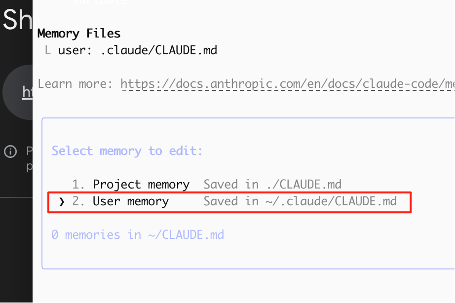
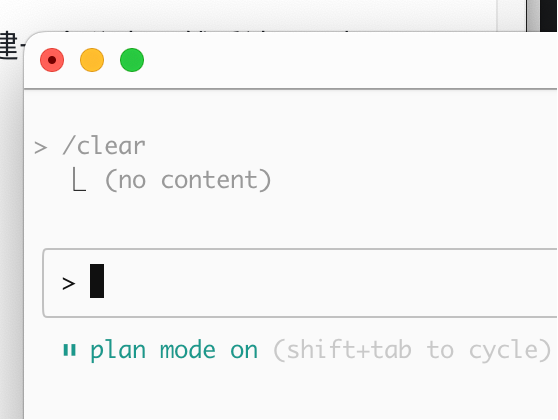
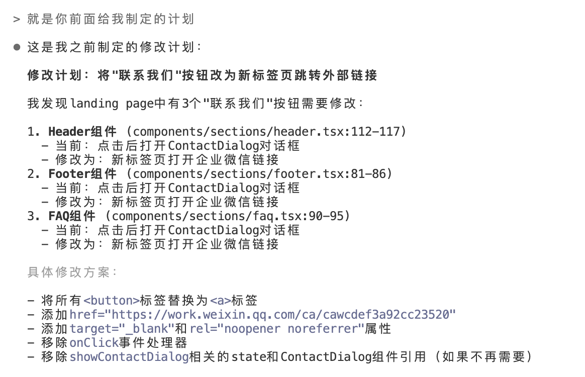
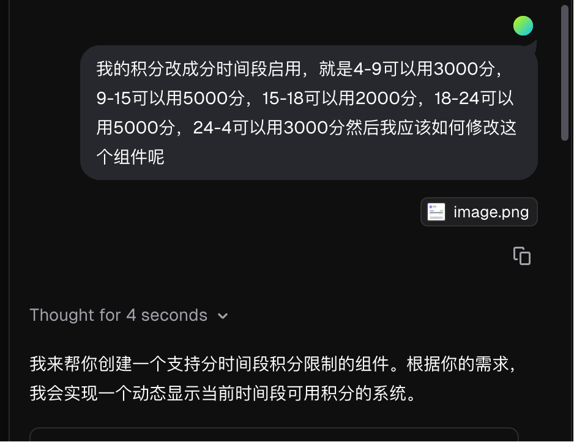
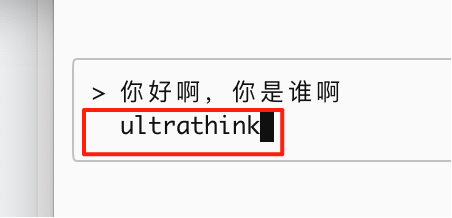
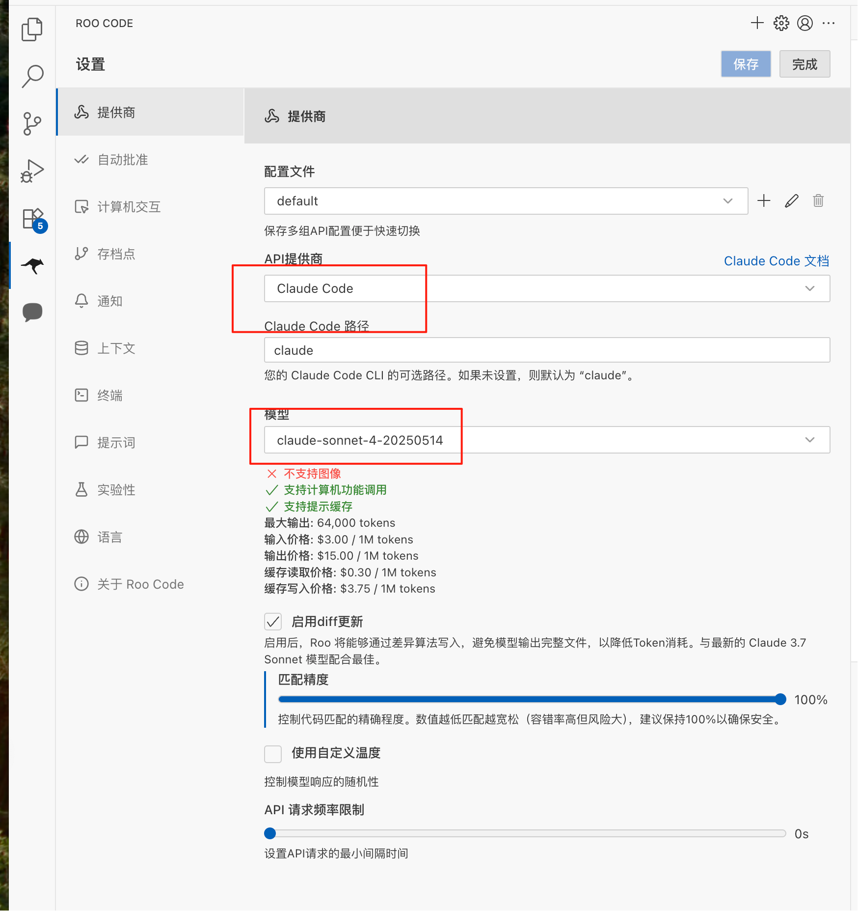
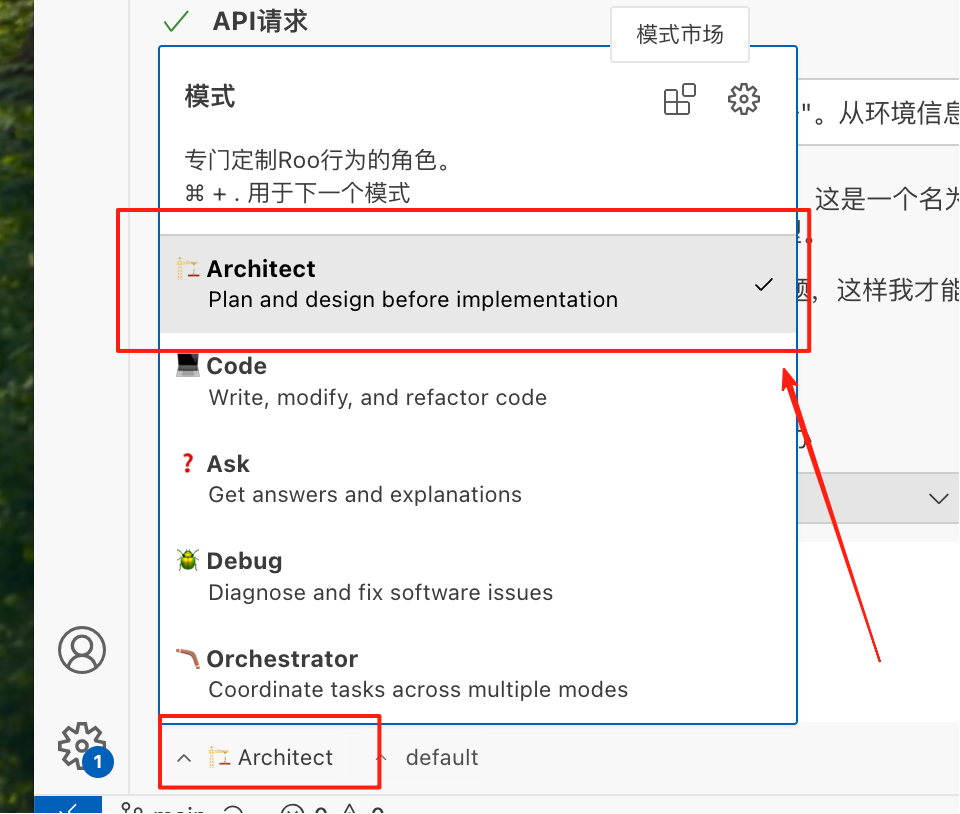
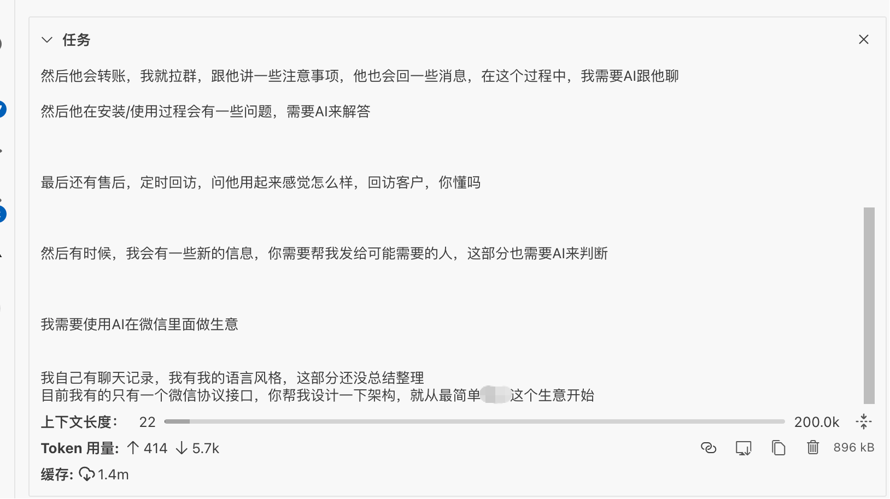
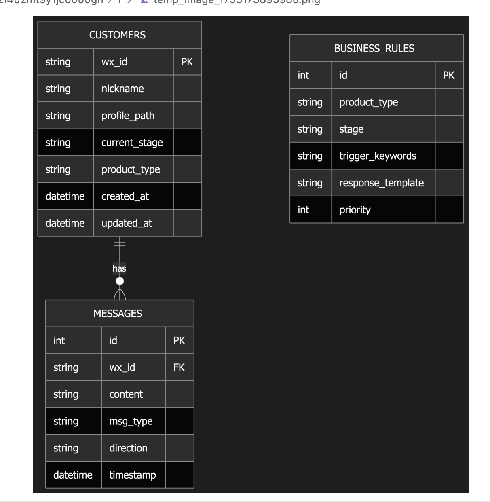
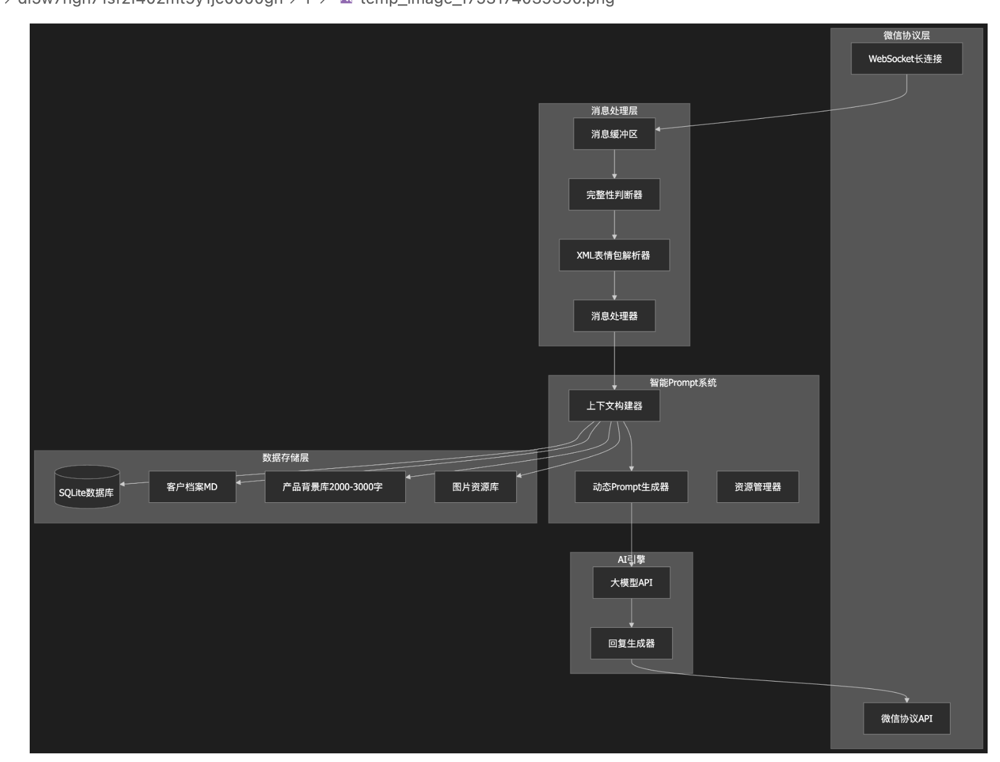

**Claude Code 必看教程**

**看完之后你会获得什么？**

Claude code 可以精准的实现你的需求

节约大量积分

知道未来应该如何提高

这篇文章，群友催更很久了，今天刚闲下来，请耐心的逐字阅读完，能让你的AI编程提高一个Level

看完觉得有收获，想支持一下的，可以买[我的 Claude code
镜像服务](http://aicodewith.com)

这篇文章不会讲具体的执行细节，只讲思路，具体细节可以善用以下工具，在这里我只讲重点思路

ChatGPT o3

Gemini 2.5 pro

B站

谷歌

豆包

**[最后如果实在搞不定，可以终端开 Claude Code
，让他帮你看看]{.underline}**

**[请使用 Plan
mode，不要让他帮你实现出来，要让他给你讲明白]{.underline}**

**[你一定要清楚的明白 AI
要做什么，以及做了什么，这是一个苦功夫，不要骗自己]{.underline}**

**[如果不这样做，你会面对一个根本无法修改的屎山]{.underline}**

如果不会向 AI
提问，或者看不懂回答，请你在问题前加上自己的现状，并且让AI使用类比来解释，下面是举例

例子A：不理解概念

---

Plain Text\
 我是一个什么都不会的新手小白，完全没有任何编程基础\
 我原来是做xxx行业的，我不理解计算机中的xxx概念\
 请你用类比的方法，用生活中常见的东西，来对比解释

---

例子B：不理解他上面做了什么

---

Plain Text\
 我是一个什么都不会的新手小白，完全没有任何编程基础\
 我不理解你上面为什么要这样做，那样做是遇到了什么问题/目的是为了解决什么问题/用的方法是什么\
 请你用类比的方法，用生活中常见的东西，来对比解释

---

之后就和 AI 聊，不断的清晰改进自己大脑里面的理解

相信我，他绝对会让你完全的明白任何知识的，别的行业也都一样，小孩子的学习也一样

---

千万不要骗自己！一定要耐心的理解所有的东西！

---

这个是我之前做的视频，讲如何使用追问，刨根问底学习的

**\[该类型的内容暂不支持下载\]**

**强烈建议设置的全局提示词**

无论你的编程经验是什么，都推荐你安装这个全局提示词

可以及时的指出你的问题，而不是一味的执行一些愚蠢的任务

愚蠢的任务：给我写一个xxx系统；给我写一个小程序

---

Plain Text\
 用中文回答我\
 每次都用审视的目光，仔细看我输入的潜在问题，你要指出我的问题，并给出明显在我思考框架之外的建议\
 如果你觉得我说的太离谱了，你就骂回来，帮我瞬间清醒

---

安装方法：

命令行输入 claude -\> 在对话框里输入 /memory -\> 选择第二个 User memory

{width="3.15625in"
height="2.1041666666666665in"}

**使用 Git 管理项目**

Claude code 是没有代码版本管理系统的，所以只能通过 Git 来管理

我觉得这是很好的，因为版本管理系统，做的最好的就是 Git
，干嘛要重复造轮子呢？

具体 Git 是什么，以及其中的概念，我不讲，你可以用下面的提示词去问
AI，然后学习

---

Plain Text\
 我是一个什么都不会的新手小白，完全没有任何编程基础\
 我不理解[使用Git管理项目是什么]{.underline}，那样做是遇到了什么问题/目的是为了解决什么问题/用的方法是什么\
 请你用类比的方法，用生活中常见的东西，来对比解释

---

这个是我用上面提示词随便问的，可以参考下，没理解的话请继续对话：https://g.co/gemini/share/3b67404b1c6d

使用 Git 提交代码的时间

每一个小功能，甚至一个小的函数

如果 AI 完全写错了，直接清掉所有未提交的修改，不要让他继续改！\
优化初始的提示词，让他不要做xxx，明确初始提示词里面模糊的信息

如果你写了一个比较大的功能，需要前端，后段，巴拉巴拉之类的，新建一个分支，然后让ai一点点写，你一点点测试，最后合并到主分支上面\
千万不要攒一大坨文件去提交，非常容易出问题！

提交了之后，一定要新开对话！

**每次对话都必须使用 Claude Code 的 Plan Mode**

MacOS 使用 shift + tab 切换

Win 使用 alt + M 切换

{width="2.7291666666666665in"
height="2.0625in"}

先用这个跟他聊方案，明确了一切细节之后再执行

最后会给你下面这样的一个plan，很细节，不过应该是绿色框框住的，我这个没有，随便截图下了

{width="5.6875in"
height="3.6666666666666665in"}

**前端使用 v0 画组件**

另一个比较高频的问题就是，Claude Code 的画组件不太行，改不对

https://v0.dev/

用这个东西，直接画一个组件，然后拷贝代码，直接扔给 Claude
Code，让他帮你接数据

**举例：**

下面是当时官方砍额度，积分系统要改一下，然后我觉得这个组件会很复杂，Claude
Code 肯定搞不定，于是我这样跟 v0 说，然后截图丢过去

{width="4.270833333333333in"
height="3.2916666666666665in"}

然后反复讨论，就得到了这个组件

{width="4.875in"
height="3.6666666666666665in"}

直接把组件的代码，全部丢给 Claude Code ，他就可以正确的接入线上数据

不过后面废弃了这个，但是这个组件直接让 Claude Code 写，肯定是写不出来的

**使用 AI 擅长的技术栈**

网站：Nextjs，Typescript

后端：Python

样式：Taliwind CSS

数据库：Supabase，嫌贵的话可以用 Postgres

存储 / 域名 / Worker：CloudFlare

部署：Vercel

上面是 AI 写起来效果最好的，可以吃尽 AI 编程发展的红利

用过的都说爽，公司代码用不了就算了；**[自己搞私活，弄第二曲线，一定要用上面的东西]{.underline}**

**[因为 AI 擅长，所以上面的代码越来越多；因为上面的代码越来越多，AI
越擅长]{.underline}**

**使用 opus + ultrathink + plan mode**

ultrathink 的开启办法就是在提示词中加上 ultrathink
关键字，任意位置都可以

{width="3.5in"
height="1.6979166666666667in"}

需要注意，这个模式会非常消耗积分/token，因为上文将会变的非常的长

但是这个是最聪明的，只要任务分的足够好，基本上可以一遍过所有任务

但是又因为他可以一遍过任务，所以也有可能节约token/积分，不会兜圈子了

**使用 Roo Code 分析架构，得到架构图，然后发给AI**

在 Vscode 里面 安装 Roo Code 插件

模型供应商选择，claude code

{width="3.1041666666666665in"
height="3.3020833333333335in"}

sonnet 就好；opus 太贵了；钱包扛不住

{width="3.625in"
height="3.0833333333333335in"}

下面交互模式选择 Architect 架构模式，不要用它编码，太慢了，而且效果没有
Claude Code 好

{width="5.177083333333333in"
height="2.90625in"}

这个是我之前想做一个 AI
微信客服机器人，我直接跟他讲需求，然后反复的聊，明确需求，下面是讨论得到的架构图

数据库设计

{width="3.5833333333333335in"
height="3.6770833333333335in"}

然后他会给一些架构设计图，非常的清晰，后面让 AI 执行起来也方便

这个是之前得到的一个部分：[Online FlowChart & Diagrams Editor - Mermaid
Live
Editor](https://mermaid.live/edit#pako:eNqFk1tPGkEUx7_KZp7aBIjswgr7YAMIZBMFCmtJu_CwylaN5RKEpC2SWK2ACRcbKmCamGotmDZAL8YmiPbTzAx8C_eCcmkN8zS753f-539mzqTASjQkAgasxoXYGsFZAxFCWpvJZfVHAPjFZV90ZUNMwJ87AaCG5eX38cNQ6xTl_uDv7SCh1c4RNrfLxff-HqPiV9w6wQcZeHQeHGbKYYXz2m3PeHSZQ-_aEoo-Xg45MRJSN__4UXmYy-Cr9xOWZD1F2LrkcNi9A2ncLcPML5jvjFhQAYV1et1LHhk-6vR2rwe6Y34HhEJz7KLMVi_71Qv8rQpLXyY7fNi5hYW5M1RpTrhWJBVxh9u7aOG4e-focxd2SzBfGfdzj6n-PZyBd8fEiIWV91rDqHMppkAer9tqsbILLPech608OrxA2w1U38HFbO-mDLOdqeZh5jduVtB-o3eSn2hgRFwpNm-3sT7W7UqpBYg5ol_Lwe3uk_Qw546RE7ZQrb1FcF7W6ZRa7zXqsPRBOqtPx_CsEHwgBR7Utwi_heV4fNXAV03c3Ic3e-qxTR-hwx-o0ILNGtw5n7wM1YXah5V_5Hu6sJ4QBwmd8uMRP3L10QmaVrW_V8DXLXVcRktKz8HBOnlcbMPTXViq9bMlFQ0OJ26SHjvn_wblqx9zBDTSG18PASYRT4oaEBbjYUH-BCk5GgCJNTEsBgAjbUNCfEN2mJZyYkLkRTQavkuLR5Ora4B5KbzalL6SsZCQEOfXBanHISIVFOO2aDKSAAxpNCkagEmB14DR6806mpohzSRJUbTZSFIa8AYwBp2RNppIykRTBtJEmcm0BrxVqup1lMGop2fo2Vk9bSJJMn0LYnS4tA)

后面出问题了也好定位调试

{width="5.75in"
height="4.385416666666667in"}

不要用它写代码！架构设计完成之后，让他输出一分 MD 文档，让 Claude Code
执行

具体的玩玩就知道了

**尽量不用图片，如果非要发送截图，尽量截的精准一些**

因为图片会占用大量的上下文，同时信息密度不高

会浪费很多空间，让模型"降智"

如果不得不截图，尽量截小一点，比如网页弄小一点，只截组件的一部分，等等

**如果单文件行数太多，请务必让 Claude Code 重构拆分**

**不拆分的话，AI 会出现幻觉，效果越写越差**

重构方法参照上面的，用 Roo Code 写重构计划，注意不要过度的拆分了

具体判断的方法，思路可以参考后面的《设计模式》《代码简洁之道》

这两个思想很重要，一定要学习理解

这样才能指导 AI 写出好代码

**如果有一个部分业务逻辑十分复杂，请单独拆分成服务**

**不拆分成服务，AI 也会出现幻觉，效果越写越差**

就是拆分完文件还是很复杂，一堆 if
else，一堆状态管理，一堆状态转换，复杂的要命

一定要单独拆分成服务，通过 http 通信就好了

再再再复杂，就上消息队列之类的东西

**如何判断 AI 给的方案好不好**

学习一下《设计模式》《代码简洁之道》

这两个东西，非常非常非常非常重要！

提示词还是跟开头的一样

---

Plain Text\
 我是一个什么都不会的新手小白，完全没有任何编程基础\
 我不理解《代码简洁之道》，那样做是遇到了什么问题/目的是为了解决什么问题/用的方法是什么\
 请你用类比的方法，用生活中常见的东西，来对比解释

---

或者当你不会判断的时候，你可以问问 AI
：这个方案，分别采用了哪个设计模式/是否符合代码简洁之道，每一种的优点是什么

然后你看看优点是不是你要的，是不是引入了新的缺点就好了

+:-----------------------------------------------------------------------------------------------------------+
| 设计模式是软件工程的必修课，我掌握的也一般，**常用的设计模式就几种**，了解了之后就可以决策出来更好的方案了 |
| |
| 大家不用太害怕 |
+------------------------------------------------------------------------------------------------------------+
